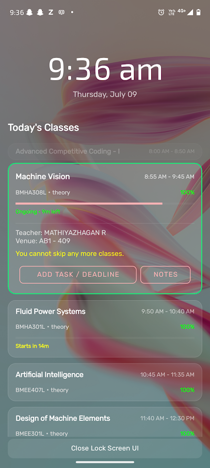

# VIT Student (Enhanced Edition)

This repository is a fork of the original [VIT Student](https://github.com/therealsujitk/android-vtop-chennai) app created by **Sujit Kumar**. 

The original project can be found at [therealsujitk/android-vtop-chennai](https://github.com/therealsujitk/android-vtop-chennai). All credit for the core features, database integration, and original VTOP client goes to him.

---

## Major Additions & Enhancements

This edition introduces several major features focused on lock screen integration, task management, and schedule customization:

### 1. Lock Screen UI Overlay
* **What it is**: An interactive layout that overlays the system lock screen to show the current day's classes, timings, and pending tasks directly when the user wakes their phone.
* **How it works**:
  - The UI uses window flags to draw itself directly on top of the lock screen without requiring the user to unlock their phone.
  - It displays the daily timetable slots as cards. Completed classes are thinned and dimmed, ongoing classes are highlighted with neon borders and progress indicators, and upcoming classes show a "Starts in X minutes" count.
  - Clicking any class card expands it to reveal details (faculty, venue) and list any custom tasks/deadlines for that course.
  - Once the user successfully unlocks the device, the overlay automatically finishes.

  
  &nbsp;&nbsp;&nbsp;&nbsp;
  

### 2. Task & Deadline Management
* **Create & View Tasks**: You can set custom tasks, assignments, or deadlines for individual subjects. 
* **Dynamic Integration**: Tasks can be created directly inside the app (via timetable and course detail bottom sheets) or from the lock screen overlay itself.
* **Alert Notifications**: When a task's start time is reached, the app schedules an exact alarm to post a notification reminder to ensure deadlines are never missed.

  
  &nbsp;&nbsp;&nbsp;&nbsp;
  

### 3. Lock Screen Scheduling (Time Windows)
* **Custom Time Window**: You can schedule the active window during which the lock screen overlay is allowed to show (e.g. from 8:00 AM to 6:00 PM). Outside this scheduled window, the overlay will remain disabled to prevent disturbance.

  

### 4. Course-Specific Notes
* **What it is**: A dedicated note-taking space for every course, letting you write instructions and insert images (such as class slides, blackboard drawings, or guidelines) right inside the app or directly over your lock screen.
* **Why we built it (Logical Reason)**: During lectures, professors frequently mention specific guidelines for reports, changes to test formats, or additional references. Rather than opening a separate app or forgetting the instructions, you can save them directly under that specific course.
* **Key Features**:
  - **Quick Access**: Access your notes in a single click from the timetable, course page, or lock screen.
  - **Rich Blocks**: Type text, insert gallery images at your cursor, and type above/below them seamlessly.
  - **Full-Screen Viewer**: View embedded images in full-screen on click, and go back by pressing the back button.
  - **Undo Guard**: If you accidentally delete an image, a 7-second "Undo" bar allows you to restore it instantly.
  - **Auto-Save**: Everything you type is automatically saved in the background, ensuring no notes are ever lost.

  

### 5. Google Gemini Auto-Sync & Captcha Solver `[UNDER DEVELOPMENT / EXPERIMENTAL]`
> [!WARNING]
> **Under Development:** The background CAPTCHA solving engine and auto reCAPTCHA handling are currently in an experimental phase and undergoing active development due to portal verification changes. You may experience connection or synchronization issues.

* **What it is**: A background synchronization engine intended to periodically update class timetable and attendance data without manual intervention.
* **Why we built it (Logical Reason)**: Academic portals often log you out or require fresh data refreshes. Manually solving captchas every time you want to check your latest timetable is tedious. By automating the process, the app stays updated in the background, making your lock screen timetable immediately accurate when you wake up your phone.
* **Key Features**:
  - **Gemini Captcha Solver `[Under Development]`**: Uses a Google Gemini API Key (`gemini-2.5-flash` model) to analyze and solve alphanumeric VTOP captchas in the background.
  - **Dynamic API Key Check `[Under Development]`**: Verifies key validity dynamically on the profile screen with visual feedback (green checkmark for success, red X with specific error messages for failures).
  - **Smart Interval Control**: Allows setting periodic intervals (minimum 2 hours) for background sync runs.
  - **reCaptcha Detection & Recovery `[Under Development]`**: Detects Google image reCaptcha blocks, automatically cancels the current run to save battery, and reschedules a new attempt 10 seconds later.
  - **WakeLock Support**: Uses a partial CPU WakeLock to keep background operations alive even when the phone screen is off or in deep sleep (Doze mode).

### 6. Redirection-based App Updates
* **What it is**: An improved update workflow that informs the user of a new release and redirects them to the official GitHub releases page in their device web browser when clicking the download button.

### 7. Dedicated Full-Screen Sync Logs Screen
* **What it is**: A dedicated full-screen logs activity that replaces the old pop-up dialog, built to perfectly match the app's overall Material Design theme.
* **Key Features**:
  - **Status Indicators**: Clean green and red check/cross labels indicating SUCCESS or FAILURE of background sync runs.
  - **Quick Clear**: One-tap action to clear all local synchronization logs from the device.
  - **Back Navigation**: Quick chevron-left back button that complies with the native Android back navigation.

---

## Required Permissions
For the lock screen UI and background scheduling to work, the following permissions must be enabled:
1. **Display Over Other Apps (System Alert Window)**: Allows the schedule UI to draw on top of the system lock screen activity.
2. **Exact Alarms & Reminders**: Essential for triggering timetable slot updates and task reminder notifications precisely on time.
3. **Notifications**: Required to post task deadline alerts and timetable class changes.
4. **Device Administrator (Optional)**: Needed only to turn off/lock the screen instantly via a double-tap gesture on the lock screen overlay.
5. **Wake Lock**: Prevents the phone's CPU from entering low-power sleep while the background sync is actively running.

---

## Technical Struggles & Solutions (Lock Screen UI)

During the development of the Lock Screen UI, we encountered two major hurdles:

### Struggle 1: Displaying the UI Over the Lock Screen Securely Across Android Versions
* **The Struggle**: Android restricts drawing custom windows or activities over the lock screen due to security guidelines. Older methods became deprecated in newer API levels (API 27+), and ensuring that the activity dismissed itself smoothly when the user unlocked their phone was unreliable.
* **The Solution**: 
  - We implemented conditional flags that utilize the modern API `setShowWhenLocked(true)` for Android Oreo MR1 and above, while falling back to `WindowManager.LayoutParams.FLAG_SHOW_WHEN_LOCKED` for older versions.
  - We registered a dynamic `BroadcastReceiver` that listens for the system `Intent.ACTION_USER_PRESENT` event. The moment the user unlocks their device, the broadcast receiver intercepts it and cleanly finishes the overlay activity, returning them to their home screen.

### Struggle 2: Implementing Double-Tap to Sleep Gestures
* **The Struggle**: Turning off the device screen programmatically is heavily locked down by the Android operating system to prevent malicious apps from taking control of the screen.
* **The Solution**:
  - We registered the lock screen activity to support the Device Administration API.
  - When the user double-taps the screen, a gesture detector catches the event and invokes `DevicePolicyManager.lockNow()`. 
  - If permission is missing, it prompts the user to activate the app as a Device Administrator through a system dialog, enabling a clean screen lock mechanism without rooting.
